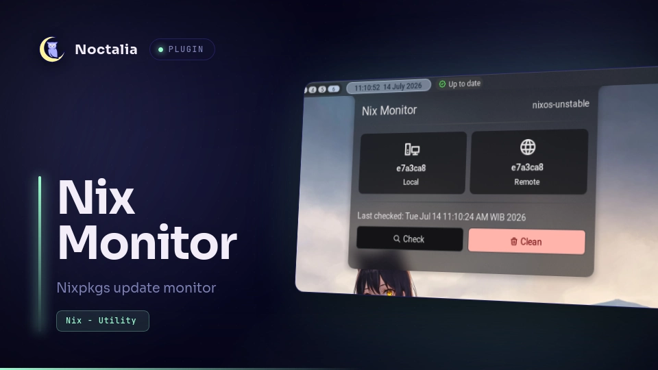

# Nix Monitor

*Nix Monitor* checks Nixpkgs update by comparing local nix hash and remote nixpkgs's hash. It also can run update and clean command.

No AI is used here but this is my first time writing Luau and plugin in general, so expect some bug. PRs are welcomed!
